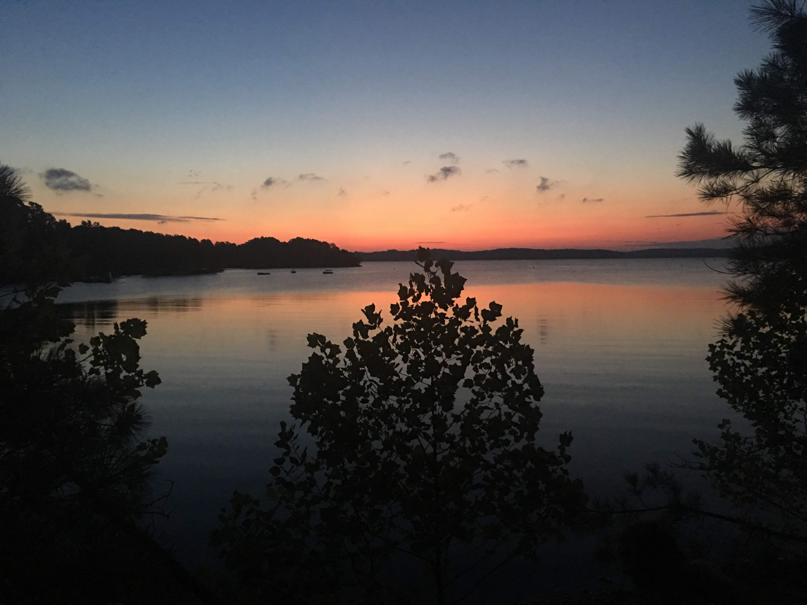

# Bear Creek Aquatic Center
## A Girl Scouts of Kentuckiana property located in Western Kentucky on Kentucky Lake

    
_View of the sunrise from the shoreline by the Coke Top living unit (photo by Beth Ann Winebarger)_

## Camp Facts and History
* The camp is 183 acres of forested and moderately developed land.
* The camp property has been a Girl Scout camp since 1944.
* BCAC is open to troop camping nearly year-round and is filled with summer resident camps in June and July. __To reserve for troop camping, visit: https://www.gskentuckiana.org/en/our-council/camp-properties/bear-creek-aquatic-center.html__
* The property hosts a wide variety of aquatic activities including kayaking, canoeing, sailing, windsurfing, paddleboarding and swimming. 
* On-shore activities include archery, teams course, arts and crafts, games in the meadow, and singing.
* __Summer 2020 Camp Registration: https://www.gskentuckiana.org/en/camp/resident_camp.html__

    
_Campers and Counselors sailing a flying scot on Kentucky Lake (photo by Beth Ann Winebarger)_

## Base Map

[Base Map (PDF)](basemap\Layout.pdf)
[Base Map (JPG)](basemap\bcac.jpg)    
_Base map created showing the aerial imagery (NAIP 2018, 2ft imagery) along with an exaggerated hillshade to show the local relief. Created by Beth Ann Winebarger in 2019_

    
 _Two campers walking down the main camp trail (photo by Beth Ann Winebarger)_

## Site Map
This site map of the property was developed in 2019 by using an iPhone application called Avenza Maps. Features across the property were recorded using GPS location and photographs. The map was then developed and is avaliable here for download (as a PDF or JPG) for any new or old visitors to the camp property.

[Site Map (PDF)](sitemap\Update_10_15_19_BCAC.pdf)     |      
[Site Map (JPG)](sitemap\BCAC_Draft_2.jpg)    
_Site map created for BCAC by Beth Ann Winebarger_

## Contour Map

[Contour Map (PDF)](contour\contour_map.pdf)
[Contour Map (JPG)](contour\contour_map.jpg)    
_Contour map created for BCAC with 10ft contours (every 100ft index contour is bold) by Beth Ann Winebarger in 2019_

    
_A counselor/lifegaurd instructing campers on the Aqua Finn sailboats during a boating lesson_

## Ecological Site Analysis
The ecology of a site is integral to how that land should be managed and used by its inhabitants. Since Girl Scouts always leave a place better than how they found it, it is important for Girl Scouts of Kentucky to be mindful of the ecology of this beautiful property. This [ecological site analysis](site_analysis.md) was updated in 2019 using resources from the Kentucky Geological Survey and Web Soil Survey. (_by Beth Ann Winebarger_)

## Sources and Tools
* Point cloud and derived elevation data from KY From Above (2018)
* Aerial imagery from KY NAIP 2018, with 2ft accuracy
* GPS Data collected by Beth Ann Winebarger (2019)
* Images taken by Beth Ann Winebarger (2017)

Site Map was developed by using Avenza Maps smart phone application to collect GPS data in the field which was then processed in ArcGIS 10.7. 
Base Map was developed using the LiDAR point cloud of Kentucky which was used to develop the digital elevation model and hillshade. The aerial imagery was used as a back-drop and the camp property outline was created by Beth Ann Winebarger.
Ecological Site Analysis was written by Beth Ann Winebarger (2019) based on resources from the Kentucky Geological Survey, Web Soil Survey, and United States Geological Survey. 

### Metadata
* This website is a product of work completed through an Independent Study and GEO 409: Advanced GIS.
The goal of this project is to help provide data and information to potential visitors and volunteers connected to Bear Creek Aquatic Camp
* Completed by Beth Ann Winebarger
* Last Update: December 2019